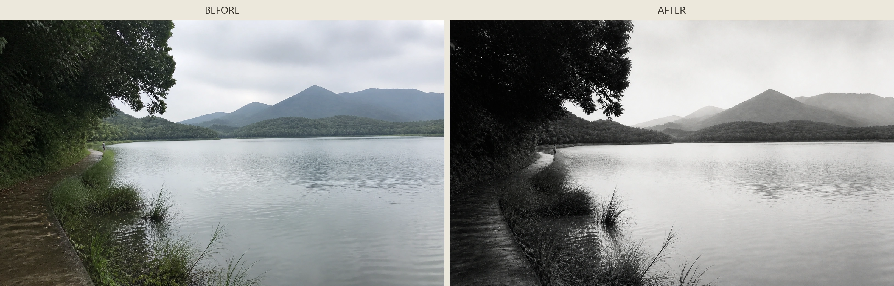

# compose-jingshan-landscape

**Author: junhaogege_**

[中文](README.md) · [Comparison](#comparison-example) · [Install](#installation) · [Compatibility](#compatibility) · [Portable prompt](#doubao-and-general-ai-tools) · [Release](#release-package)

An Agent Skill for photo editing and image generation inspired by Lang Jingshan's composite photography and Chinese pictorialist landscape tradition. It transforms mobile landscapes, figures in landscape, and quiet everyday scenes through source-faithful editing, visible real-scene layering, no-photo semantic distillation, atmospheric depth, and the Chinese idea of the meaningful unpainted area.

> A tribute to Lang Jingshan, widely recognized as a pioneering figure in Chinese photography. This independent learning and contemporary visual experiment is not officially affiliated with or endorsed by Lang Jingshan, his family, or related institutions. The distribution approach and creative exploration were informed in part by [Zeejay0's Gathered Scenes Zine Skill](https://github.com/Zeejay0/gathered-scenes-zine-skill).

## Comparison example



The left panel is a project-owned AI demonstration source. The right panel is the generated `5:3` result. The deterministic comparison script assembles both panels without generative rewriting or cropping. This workflow example is not a historical photograph or an artwork by Lang Jingshan.

## Search name

Use the exact identifier in GitHub or an AI tool that can search GitHub:

```text
compose-jingshan-landscape
```

Repository: [junhaogege6/compose-jingshan-landscape](https://github.com/junhaogege6/compose-jingshan-landscape)

A public GitHub repository is searchable by name, but it is not automatically listed in the official Codex, ChatGPT, or third-party Skill/Plugin Directory. Directory publication is a separate process.

## Creative modes

| Mode | Result |
| --- | --- |
| `jingshan-single` | A standalone pictorial photograph that preserves source facts |
| `jingshan-layered` | One artwork combining a truthful photo anchor with an interpreted paper-and-mist field |
| `jingshan-distilled` | A complete pictorial reconstruction that uses the photo only as semantic evidence and retains no photo fragment |
| `before-after` | An exact deterministic source/result comparison board |
| Layered comparison | A layered artwork plus the deterministic comparison board |
| `poetic-small-scene` | Branches, vessels, window shadows, street corners, and other quiet mobile-photo scenes |

The Skill preserves subject identity, meaningful action, and photographic facts by default. It does not prove a Chinese aesthetic by applying an ink-wash filter; it rebuilds the image through selection, depth, mist, paper white, and Chinese landscape spatial logic. Without an explicit ratio, portrait subjects route to `3:5` and expansive landscapes route to `5:3`.

## Installation

### Ask Codex to install from GitHub

```text
Install the compose-jingshan-landscape Skill from the GitHub repository junhaogege6/compose-jingshan-landscape.
```

### Manual Codex installation

macOS / Linux:

```bash
git clone https://github.com/junhaogege6/compose-jingshan-landscape.git
mkdir -p ~/.codex/skills
cp -R compose-jingshan-landscape/compose-jingshan-landscape ~/.codex/skills/
```

Windows PowerShell:

```powershell
git clone https://github.com/junhaogege6/compose-jingshan-landscape.git
New-Item -ItemType Directory -Force "$HOME\.codex\skills" | Out-Null
Copy-Item -Recurse ".\compose-jingshan-landscape\compose-jingshan-landscape" "$HOME\.codex\skills\compose-jingshan-landscape"
```

Open a new task after installation. Restart the host application if the Skill does not appear immediately.

### ZIP import

Download `compose-jingshan-landscape-v1.1.0.zip` from [Releases](https://github.com/junhaogege6/compose-jingshan-landscape/releases). The archive contains exactly one top-level Skill folder with `SKILL.md` at its root.

## Compatibility

| Product or environment | Method | Compatibility level |
| --- | --- | --- |
| Codex | Install the Skill folder from this repository | Native Agent Skill |
| ChatGPT Skills | Upload the release ZIP when Skills are available for the account | Native open format; availability depends on plan and workspace settings |
| TRAE | Import the folder containing `SKILL.md` | Native Agent Skills format |
| Volcengine AgentKit | Upload the release ZIP to Skills Center | ZIP import |
| Claude, Claude Code, and other Agent Skills hosts | Import the folder or ZIP according to host documentation | Format-compatible; image capability depends on the host |
| Consumer Doubao and general AI chat tools | Use [`PORTABLE_PROMPT.md`](PORTABLE_PROMPT.md) | Prompt compatibility, not native installation |

OpenAI Skills follow the open Agent Skills standard, but image editing, filesystem access, and script execution differ across hosts. Output consistency therefore depends on the selected model and tools.

References: [OpenAI Skills](https://help.openai.com/en/articles/20001066) · [Volcengine AgentKit Skill package requirements](https://www.volcengine.com/docs/86681/2205064)

## Doubao and general AI tools

Use the project through prompt compatibility when the host cannot install Agent Skills:

1. Open [`PORTABLE_PROMPT.md`](PORTABLE_PROMPT.md).
2. Paste its portable prompt into a new conversation or custom-assistant instruction field.
3. Upload a photograph and request a Jingshan single artwork, real-scene layered artwork, no-photo distillation, or before/after output.
4. If the host lacks image editing, ask it for an executable image prompt and composition plan, then run that prompt in an image-capable model.

This preserves the main creative decisions but is not the same as native Skill installation. A host without Python execution cannot automatically build the deterministic comparison board.

## Example requests

```text
$compose-jingshan-landscape Rework this mobile photograph in a Lang Jingshan-inspired direction. Preserve the vase and branches and strengthen the meaningful unpainted space.
```

```text
$compose-jingshan-landscape Create one layered artwork with a clearly recognizable source-photo anchor dissolving into paper, mist, and pictorial mountain space.
```

```text
$compose-jingshan-landscape Fully distill this photograph into a Jingshan-inspired artwork. Use it only as semantic evidence and retain no photographic fragment.
```

```text
$compose-jingshan-landscape Rework this horizontal landscape at 5:3 while preserving the full shoreline and lateral roaming path.
```

```text
$compose-jingshan-landscape Produce the standalone artwork and an exact source/result comparison board.
```

## Input and color

- Accept one primary photograph and up to three optional supporting photographs.
- There is no mandatory source color palette. The Skill performs controlled color reduction according to subject, light, and mood instead of applying one fixed grade.
- Without an explicit ratio, the Skill routes between portrait `3:5` and landscape `5:3`; explicit `4:5`, `2:3`, `3:2`, `16:9`, `1:1`, `9:16`, and original-ratio output are supported.
- Artistic output requires an image-editing or image-generation capability.
- `scripts/build_comparison.py` requires Pillow and creates deterministic comparison layouts; it does not generate the artwork.

## Repository

```text
compose-jingshan-landscape/
├── README.md
├── README.en.md
├── PORTABLE_PROMPT.md
├── LICENSE
├── docs/images/                 # public comparison example
└── compose-jingshan-landscape/
    ├── SKILL.md
    ├── agents/openai.yaml
    ├── references/
    └── scripts/build_comparison.py
```

## Release package

The standard release archive contains only the installable Skill. It excludes repository documentation, demonstration images, design notes, and Git metadata. Release: [v1.1.0](https://github.com/junhaogege6/compose-jingshan-landscape/releases/tag/v1.1.0).

## Privacy

In addition to instructions, references, and the comparison-layout script, the repository publishes only project-owned AI demonstration source/result media. It contains no private user photographs, private tests, paths, or generation history. The release ZIP contains no demonstration images. Choose an image-processing provider that matches your privacy requirements.

## License

[MIT License](LICENSE)
