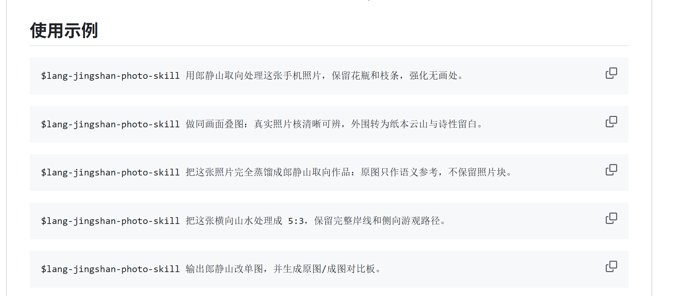

# lang-jingshan-photo-skill

**作者 / Author：junhaogege_**

[English](README.en.md) · [对比示例](#对比示例) · [作品档案](#作品档案) · [安装](#安装) · [GitHub 过渡](#github-过渡) · [兼容性](#兼容性) · [豆包与通用-ai](#豆包与通用-ai) · [商业授权](#商业授权) · [发布包](#发布包)

一个以郎静山集锦摄影与中国画意摄影为主要方向的摄影修图 Agent Skill。它把手机拍摄的风景、人在景中与日常小景，重构为具有云山层次、诗性留白和“无画处”意识的作品，同时支持摄影改单图、同画面实景叠层、无照片块影像蒸馏、可选竖排中文题字及原图/成图对比。

> 致敬中国摄影之父郎静山。本项目是个人学习与当代视觉实验，不代表郎静山先生、其家属或相关机构的官方授权或合作。发布方案与创作探索参考了 [Zeejay0 的 Gathered Scenes Zine Skill](https://github.com/Zeejay0/gathered-scenes-zine-skill)。

## 对比示例


左侧为项目自有的 AI 演示原图，右侧为按本 Skill 规则生成的横幅 `5:3` 暖灰银盐成图；其综合色调采用象牙高光、暖灰中间调与炭黑暗部，不使用浓棕复古或宣纸黄。对比板由确定性脚本排版，两侧均未被生成模型二次改写或裁切。演示图只用于说明工作流，不代表历史作品或郎静山先生原作。

## 作品档案

本仓库改为更接近项目仓的更新方式：README 负责总入口，真正可安装的 Skill 放在 `skills/` 下，公开案例与观察说明收在 `examples/`。

- 公开案例入口：[examples/README.md](examples/README.md)
- 可安装 Skill 入口：[skills/lang-jingshan-photo-skill/SKILL.md](skills/lang-jingshan-photo-skill/SKILL.md)

## 搜索名称

在 GitHub 或支持 GitHub 搜索的 AI 中优先输入正式 Skill 名称：

```text
lang-jingshan-photo-skill
```

GitHub 仓库：[junhaogege6/compose-jingshan-landscape](https://github.com/junhaogege6/compose-jingshan-landscape)

当前公开仓库地址仍为旧路径 `compose-jingshan-landscape`；正式 Skill 名称与调用名改为 `lang-jingshan-photo-skill`，这样既保留现有发布链接，也能让 GitHub 内容搜索和 AI 安装描述更贴近最终名字。

如果暂时搜不到，过渡期可再补搜一次旧仓库关键词 `compose-jingshan-landscape`。

公开 GitHub 仓库可以通过名称搜索，但不会因此自动进入 Codex、ChatGPT 或其他产品的官方 Skill/Plugin Directory；目录发布属于独立流程。

## 创作路径

你现在其实已经有“创作路径”了，只是之前分散在模式说明里，没有像 `Zeejay0` 那样集中展示。对这个仓库来说，更准确的不是“两种路径”，而是一个 Skill 下的三条创作路径：

| 维度 | 郎静山改单图 | 同画面叠图 | 图像蒸馏 |
| --- | --- | --- | --- |
| 适合 | 想保留原照片主体、空间和摄影事实 | 想同时保留真实照片核与画意转译场 | 想从原图中提取命题、情绪和空间手势，重建独立作品 |
| 照片的角色 | 成为最终作品的摄影骨架 | 成为同一画面中的真实锚点 | 只作为语义与情绪来源，不进入成品 |
| 转化方式 | 以三远、留白、暖灰银盐和空间重构完成改单图 | 让真实照片核与纸本云山、雾气、留白发生材料交接 | 从事实中抽出张力、视觉隐喻与空间手势后重新创作 |
| 结果 | 保留摄影落脚点的独立画意摄影作品 | 真实照片核与画意山水同画面并存的叠层作品 | 不含照片块的完整郎静山取向作品 |
| 常见表达 | “改单图”“郎静山处理”“保留花瓶和枝条” | “叠图”“照片核”“同画面叠合” | “蒸馏”“只作语义参考”“不保留照片块” |
| 调用方式 | `$lang-jingshan-photo-skill` | `$lang-jingshan-photo-skill` | `$lang-jingshan-photo-skill` |

`before-after` 不是单独的创作路径，而是附加交付方式：在上述任一路径完成后，再额外生成原图/成图对比板。

## 能做什么

| 模式 | 作用 |
| --- | --- |
| `jingshan-single` | 改单图，输出保留照片事实的独立画意摄影作品 |
| `jingshan-layered` | 在同一张成图中保留真实照片核，与纸本、留白和画意重构形成可见叠层 |
| `jingshan-distilled` | 原图只作语义和构图参考，完全重构不含照片碎片的画意摄影作品 |
| `before-after` | 生成精确、可复现的原图/成图对比板 |
| `inscription` | 可选竖排中文题字；AI 题跋不合格时回退到确定性小行楷，永久无印章 |
| `叠图对比` | 同时输出叠层艺术成图与确定性对比板 |
| `poetic-small-scene` | 处理花枝、器物、窗影、街角等手机摄影小景 |

Skill 默认保留主体身份、关键动作和照片事实，不以“水墨滤镜”覆盖原图，而是通过取舍、层次、雾气、纸白与书画式空间关系完成重构。未指定比例时，竖向主体默认 `3:5`，横向游观山水默认 `5:3`；也支持用户明确指定常用比例或保持原图比例。

## 安装

### 让 Codex 按仓库安装

直接提出：

```text
安装 GitHub 仓库 junhaogege6/compose-jingshan-landscape 里的 lang-jingshan-photo-skill Skill
```

### 手动安装到 Codex

macOS / Linux：

```bash
git clone https://github.com/junhaogege6/compose-jingshan-landscape.git
mkdir -p ~/.codex/skills
cp -R compose-jingshan-landscape/skills/lang-jingshan-photo-skill ~/.codex/skills/
```

Windows PowerShell：

```powershell
git clone https://github.com/junhaogege6/compose-jingshan-landscape.git
New-Item -ItemType Directory -Force "$HOME\.codex\skills" | Out-Null
Copy-Item -Recurse ".\compose-jingshan-landscape\skills\lang-jingshan-photo-skill" "$HOME\.codex\skills\lang-jingshan-photo-skill"
```

安装后重新打开任务；若 Skill 没有立即出现，请重启宿主应用。

### ZIP 导入

从 [Releases](https://github.com/junhaogege6/compose-jingshan-landscape/releases) 下载最新 ZIP。压缩包内只有一个顶层 Skill 文件夹，`SKILL.md` 位于该文件夹根目录，可用于支持 Agent Skills ZIP 导入的产品。

## GitHub 过渡

目前有两层名字同时存在：

- 正式 Skill 名、调用名、本地安装名：`lang-jingshan-photo-skill`
- 当前公开 GitHub 仓库路径：`junhaogege6/compose-jingshan-landscape`

同时也有两层结构分工：

- 项目仓入口：`README.md`、`examples/`、`docs/`、`assets/`
- 可安装 Skill：`skills/lang-jingshan-photo-skill/`

这样做是为了先把 Skill 侧的安装和调用收口，再保留旧仓库链接与发布页的可访问性。等你准备正式改 GitHub 远端仓库名时，可以直接按这份清单执行：

[GitHub 改名清单](docs/github-rename-checklist.md)

## 兼容性

| 产品或环境 | 使用方式 | 兼容级别 |
| --- | --- | --- |
| Codex | 安装仓库中的 `skills/lang-jingshan-photo-skill` 文件夹 | 原生 Agent Skill |
| ChatGPT Skills | 在账号支持 Skills 时上传发布 ZIP | 原生开放格式；可用性受套餐与工作区设置影响 |
| TRAE | 导入包含 `SKILL.md` 的 Skill 文件夹 | 原生 Agent Skills 格式 |
| 火山引擎 AgentKit | 上传发布 ZIP 到 Skills 中心 | ZIP 导入 |
| Claude、Claude Code及其他 Agent Skills 宿主 | 按宿主文档导入 Skill 文件夹或 ZIP | 格式兼容；图像能力取决于宿主 |
| 豆包普通客户端及其他通用 AI | 使用 [`PORTABLE_PROMPT.md`](PORTABLE_PROMPT.md) | 提示词兼容，不是原生安装 |

OpenAI Skills 遵循开放 Agent Skills 标准，但每个宿主提供的图像编辑、文件系统和脚本能力不同，因此同一 Skill 的成图一致性仍取决于所用模型和工具。

参考规范：[OpenAI Skills](https://help.openai.com/en/articles/20001066) · [火山引擎 AgentKit Skill 代码包](https://www.volcengine.com/docs/86681/2205064)

## 别人如何使用

最常见的三种用法如下：

### 1. 在支持 Agent Skills 的宿主里直接安装

- 进入本仓库
- 找到 `skills/lang-jingshan-photo-skill/`
- 按宿主要求导入整个文件夹，或导入只包含该文件夹的 ZIP
- 安装后直接描述照片和目标，不必先研究全部规则

适合：Codex、ChatGPT Skills、TRAE、AgentKit、其他兼容 `SKILL.md` 的宿主。

### 2. 在 Codex / 类 Codex 环境里手动复制

- `git clone` 本仓库
- 复制 `skills/lang-jingshan-photo-skill/` 到本地技能目录
- 新开任务后直接说需求，或显式写 `$lang-jingshan-photo-skill`

适合：已经熟悉本地技能目录、希望拿到完整规则和脚本的人。

### 3. 在豆包、WorkBuddy、普通对话式大模型里当作提示词包使用

- 打开 [`PORTABLE_PROMPT.md`](PORTABLE_PROMPT.md)
- 复制“可复制提示词”
- 粘贴到新对话、系统提示词或自定义助手设定
- 上传照片并直接给要求

适合：不能原生安装 Skill、但能读懂长提示词或支持自定义助手设定的宿主。

## 使用方法

别人实际使用时，不需要先讲风格理论。最稳的方式是按下面顺序提供信息：

1. 先给主图。
2. 再说你要哪一种输出：改单图、叠图、蒸馏、前后对比。
3. 说清楚必须保留什么：人物、花瓶、枝条、岸线、姿态、地标、服装。
4. 再说希望删掉什么：杂物、路人、广告牌、饮料杯、电线、塑料感。
5. 最后补充比例、情绪和可选题字：`3:5`、`5:3`、安静、空、远、暖灰银盐、留白更大、“竖排题云起亭深”。

一句话不够清楚时，宁可多写“保留项”和“删除项”，不要只写“做成郎静山风格”。

## 豆包与通用 AI

普通豆包客户端目前按“提示词兼容”使用：

1. 打开 [`PORTABLE_PROMPT.md`](PORTABLE_PROMPT.md)。
2. 将其中“可复制提示词”粘贴到新对话或自定义助手的设定中。
3. 上传照片，并提出“郎静山改单图”“实景叠图”“影像蒸馏”或“原图成图对比”等要求。
4. 如果宿主没有图片编辑能力，让它输出完整修图提示词与构图方案，再交给具备图片能力的模型执行。

这种方式保留主要创作判断，但不等同于安装 Agent Skill；不能运行 Python 的环境也无法自动生成确定性对比板。

## 使用示例

下面这张图是当前仓库的“使用示例面板”预览：



```text
$lang-jingshan-photo-skill 用郎静山取向处理这张手机照片，保留花瓶和枝条，强化无画处。
```

```text
$lang-jingshan-photo-skill 做同画面叠图：真实照片核清晰可辨，外围转为纸本云山与诗性留白。
```

```text
$lang-jingshan-photo-skill 把这张照片完全蒸馏成郎静山取向作品：原图只作语义参考，不保留照片块。
```

```text
$lang-jingshan-photo-skill 把这张横向山水处理成 5:3，保留完整岸线和侧向游观路径。
```

```text
$lang-jingshan-photo-skill 输出郎静山改单图，并生成原图/成图对比板。
```

```text
$lang-jingshan-photo-skill 输出郎静山改单图，在无画处竖排题“云起亭深”；采用题跋气质小行书，失败时用小行楷保底，不要印章和署名。
```

## 好用提示词

下面这些模板更适合别人直接拿去用，重点是具体、可执行、少空话。

### 1. 手机小景改单图

```text
请用郎静山取向处理这张手机照片。保留花瓶、枝条和墙面投影，删除杯子和易拉罐，让墙面的空白成为主要无画处。结果先像摄影，再显出画意，做成竖幅 3:5。
```

### 2. 人在景中的身份保留

```text
请处理这张旅行照。人物的脸、年龄感、姿态、衣服和人物身份必须准确，保留人与山坡的真实关系，把环境转成更有层次的云山与暖灰银盐气氛，输出 3:5。
```

### 3. 横向山水改单图

```text
请把这张横向风景照片改成郎静山取向。保留完整岸线、远山和侧向游观路径，压缩琐碎树叶细节，增强空气层次与留白，输出 5:3。
```

### 4. 同画面叠图

```text
请做同画面叠图。真实照片核必须清晰可辨，能看出原来的主体和空间关系；外围转为纸本、雾气和画意山水空间，不要做成普通撕纸海报，也不要加装饰标签。
```

### 5. 完全蒸馏

```text
请把这张照片只当作语义参考，完全蒸馏成郎静山取向的画意摄影。不要保留任何原照片块、摄影窗口或写实裁片，只保留它的空间手势、情绪和主体关系。
```

### 6. 带前后对比

```text
请先输出一张完整的郎静山改单图，再另外生成原图/成图对比板。原图必须保持原始内容，不要让模型重画原图；成图做成暖灰银盐方向。
```

### 7. 自适应中文题字

```text
请先完成无字成图，再在真实无画处竖排题“云起亭深”。优先尝试参考郎静山作品题跋气质的克制小行书；必须逐字正确、没有印章署名、不得重绘底图，否则自动回退到确定性小行楷。
```

### 8. 多图辅助合成

```text
主图提供人物和地形，辅助图提供远山、云雾和松树。请以主图为事实基础做郎静山取向重构，优先保留人物身份和主地貌，不要把辅助图变成拼贴感很重的素材堆砌。
```

### 9. 适合豆包 / 通用模型的写法

```text
你不要先解释理论，直接按规则执行：保留主体，删掉杂物，扩大留白，压缩细碎纹理，结果先像摄影，再显画意。如果你没有实际修图能力，就输出一份可以直接用于生图或修图的完整提示词。
```

## 颜色与输入

- 支持 1 张主图，并可选最多 3 张辅助图。
- 原图颜色没有硬性限制；Skill 会根据主体、光线与意境进行受控减色，而不是统一套用单一色调。
- 默认 `silver-gelatin` 是克制的暖灰银盐调，不是中性数字灰、棕褐老照片或黄色宣纸滤镜。
- 未指定比例时自动在竖幅 `3:5` 与横幅 `5:3` 间路由；支持 `4:5`、`2:3`、`3:2`、`16:9`、`1:1`、`9:16` 和原图比例。
- 艺术成图依赖宿主具备图像编辑或生成能力。
- `scripts/build_comparison.py` 用于确定性对比排版，需要 Pillow；它不参与艺术生成。

## 仓库结构

```text
compose-jingshan-landscape/
├── README.md
├── README.en.md
├── PORTABLE_PROMPT.md
├── LICENSE
├── assets/
│   └── brand/
├── examples/
│   └── README.md
├── docs/
│   └── images/
└── skills/
    └── lang-jingshan-photo-skill/
        ├── SKILL.md
        ├── agents/openai.yaml
        ├── references/
        └── scripts/build_comparison.py
```

## 发布包

仓库的主更新方式现在以主分支内容为准，更接近“项目仓 + skills 子目录”的持续更新方式；ZIP 仍保留为可选分发。标准发布包只包含可安装 Skill，不包含 README、演示图、设计文档或仓库元数据。当前公开发布页仍在旧仓库路径下：[Releases](https://github.com/junhaogege6/compose-jingshan-landscape/releases)。

## 商业授权

本项目现在采用“个人非商业许可”，不再允许基于 MIT 的自由商用。

- 允许：个人学习、研究、实验、爱好用途下免费使用、安装和修改
- 不允许：收费生成、代做、接单、课程、咨询、SaaS/API、客户项目、公司内部商业应用、商业培训、带货或其他任何直接或间接商业使用
- 商业合作或商业授权：必须先联系本人，并取得明确书面许可

商业联系默认通过 GitHub 账号 [junhaogege6](https://github.com/junhaogege6) 发起；也可以使用本仓库后续明确列出的其他联系方式。

## 隐私

仓库除 Skill 指令、参考规范与排版脚本外，只公开项目自有的 AI 演示原图、演示成图及确定性对比板；不包含作者或使用者的私人原始照片、私人测试图及生成记录。发布 ZIP 不包含任何演示图片。运行时请根据自己的隐私需求选择可接受的图像处理服务。

## 许可

[个人非商业许可 / Personal Non-Commercial License](LICENSE)
